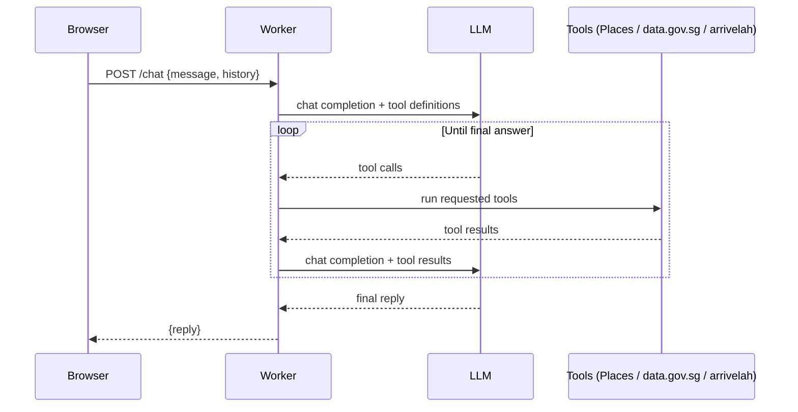

# Lunch Uncle

Lunch Uncle is a chatbot that tells you where to eat lunch near CT Hub 2, Lavender, Singapore. Uncle speaks casual Singaporean English, and he has strong opinions about where you should go.

## Architecture

Lunch Uncle runs as a single Cloudflare Worker. `src/index.js` routes requests: `GET /` serves the chat page from `src/ui.html`, and `POST /chat` hands the turn to the agentic loop in `src/loop.js`. The loop calls an OpenAI-compatible chat completions endpoint, passing the tool definitions from `src/tools.js`. When the model asks for a tool call, the loop runs it, appends the result to the message list, and calls the model again. This repeats until the model gives a final answer with no more tool calls. `src/prompt.js` builds the system prompt that sets Uncle's persona and rules. There are three tools: `find_lunch_places`, which queries the Google Places API (New) Text Search, biased towards CT Hub 2; `get_rain_forecast`, which reads the two-hour forecast from data.gov.sg (no key needed); and `get_bus_arrivals`, which reads live arrivals from arrivelah (no key needed).

## Request flow



## Setup

1. Clone this repository.
2. Install dependencies:
   ```sh
   npm install
   ```
3. Create `.env` from `.env.example` and fill in your keys:
   ```sh
   cp .env.example .env
   ```
   ```
   OPENCODE_API_KEY=your-key-here
   GOOGLE_PLACES_API_KEY=your-key-here
   ```
4. Check `LLM_BASE_URL` and `LLM_MODEL` at the top of `src/loop.js` against the endpoint and model you were given. Both are committed, so there is nothing to fill in unless your provider differs. The Go endpoint requires an `x-opencode-session` header, which `callModel` already sends.
5. Start the dev server:
   ```sh
   npm run dev
   ```
   Open http://localhost:8787 and chat with Uncle.
6. To deploy, set the secrets on Cloudflare first, then deploy:
   ```sh
   wrangler secret put OPENCODE_API_KEY
   wrangler secret put GOOGLE_PLACES_API_KEY
   npm run deploy
   ```

Secrets never go in code or in `wrangler.toml`. Local development reads them from `.env`, which is gitignored; production reads them from Cloudflare secrets set with `wrangler secret put`.

## Running tests

```sh
npm test
```

This runs Node's built-in test runner. There are no test dependencies to install.

## Course key setup

For facilitators setting up a shared Google Places key for a course run:

1. In Google Cloud Console, create a new project for the course.
2. Enable **Places API (New)** only. Do not enable the legacy Places API.
3. Create an API key under APIs & Services → Credentials.
4. Under key restrictions, choose "Restrict key" and tick only Places API (New).
5. Go to APIs & Services → Places API (New) → Quotas, and cap requests per day to a modest number, such as 1,000.
6. In Billing → Budgets & alerts, create a budget with email alerts at 50% and 100%.

Treat the LLM key the same way: one key per course run, revoked once the course ends.

## Licence

MIT.
